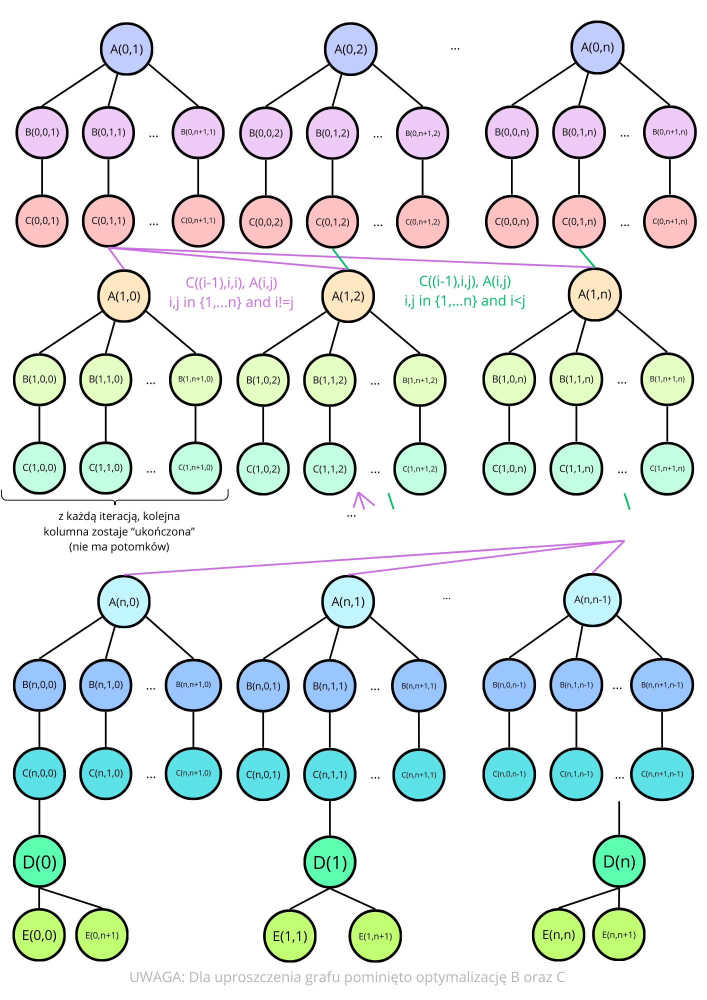

# Multithreaded Gauss-Jordan elimination
Multithreaded Gauss Jordan elimination in Java.

*Note: This implementation does not prioritize speed or space efficiency; its primary goal is educational value. It also aims to perform as few operations as possible and does so without using synchronization blocks.*
---
## Idea

Full theory used in implementation is gathered in [pdf](theory/Multithreaded_gauss_elimination.pdf), unfortunately due to nature of a subject, only in polish.

### Operations
Divide elimination of martix $M$ into [basic operations](src/operations):

- $A$ - [FindFactor](src/operations/FindFactor.java) - 
Operation $A_{ik}$ represents finding factor that will be needed while subtracting row $i$ from row $k$.

$$ A_{ik} = \frac{M_{ii}}{M_{ki}} $$

- $B$ - [MultiplyElement](src/operations/MultiplyElement.java) - 
Operation $B_{ijk}$ represents multiplying element $M_{ki}$ by already calculated factor in corresponding FindFactor operation.

$$ M_{kj} \space *= A_{ij} $$

- $C$ - [SubtractElement](src/operations/SubtractElement.java) - 
Operation $C_{ijk}$ represents subtracting $j$ column in $i$ row from $j$ column in $k$ row.

$$ M_{jk} \space -= M_{ik} $$

- $D$ - [NormalizationFactor](src/operations/NormalizationFactor.java) - 
Operation $D_{i}$ represents finding factor that will be needed for normalizing for $i$ row.

$$ D_i = \frac{1}{M_{ii}} $$

- $E$ - [NormalizeElement](src/operations/NormalizeElement.java) - 
Operation $E_{ij}$ represents multiplying element by normalization factor.

$$ M_{ij} \space *= D_i $$

### Dependency

$$
M =
\left[
\begin{array}{ccccc|c}
A_{11} & 0      & A_{13} & \cdots & A_{1n} & b_1 \\
0      & A_{22} & A_{23} & \cdots & A_{2n} & b_2 \\
0      & 0      & A_{33} & \cdots & A_{3n} & b_3 \\
\vdots & \vdots & \vdots & \ddots & \vdots & \vdots \\
0      & 0      & A_{n3} & \cdots & A_{nn} & b_n
\end{array}
\right]
$$

#### Relating to one element:
- $\{(A_{ij}, B_{ikj}) \space | \space k \in \{1,...,n+1\} \wedge i,j \in \{1,...,n\} \wedge i \neq j\}$
- $\{(B_{ikj}, C_{ikj}) \space | \space k \in \{1,...,n+1\} \wedge i,j \in \{1,...,n\} \wedge i \neq j\}$

#### Between rows - Gauss:
- $\{(C_{(i−1)ii}, A_{ij}), (C_{(i−1)ij},A_{ij}) \space | \space i,j \in \{1,...,n\} \wedge i < j \}$

#### Between rows - Jordan:
- $\{(C_{(i−1)ii}, A_{ij}) \space | \space i,j \in \{1,...,n\} \wedge i > j \}$

### Foata's Normal Form
It turns out that FNF is really straight forward as we can gather the same operations with the same starting row:

$$ FNF = $$
$$ \large[\{A_{12}, A_{13}, ..., A_{1n} \}]_{\equiv^{+}_{I}}^{\space\space\space\frown} $$
$$ \large[\{B_{112}, B_{122}, ..., B_{1(n+1)2}, B_{113}, B_{123}, B_{1(n+1)3}, B_{11n}, B_{12n}, ..., B_{1(n+1)n} \}]_{\equiv^{+}_{I}}^{\space\space\space\frown} $$
$$ \large[\{C_{112}, C_{122}, ..., C_{1(n+1)2}, C_{113}, C_{123}, C_{1(n+1)3}, C_{11n}, C_{12n}, ..., C_{1(n+1)n} \}]_{\equiv^{+}_{I}}^{\space\space\space\frown} $$
$$ \large[\{A_{21}, A_{23}, ..., 𝐴_{2n} \}]_{\equiv^{+}_{I}}^{\space\space\space\frown} $$
$$ \large[\{B_{211}, ..., B_{2(n+1)2}, B_{223}, ..., B_{2(n+1)3}, ..., B_{22n}, B_{2(n+1)n} \}]_{\equiv^{+}_{I}}^{\space\space\space\frown} $$
$$ \large[\{C_{221}, ..., C_{2(n+1)2}, C_{223}, ..., C_{2(n+1)3}, ..., C_{22n}, C_{2(n+1)n} \}]_{\equiv^{+}_{I}}^{\space\space\space\frown} $$
$$ ...^{\space\space\space\frown} $$
$$ \large[\{A_{n1}, A_{n2}, ..., 𝐴_{n(n-1)} \}]_{\equiv^{+}_{I}}^{\space\space\space\frown} $$
$$ \large[\{B_{n11}, B_{nn1}, B_{n(n+1)1}, B_{n22}, B_{nn2}, B_{n(n+1)2}, ... , B_{n(n-1)(n-1)}, B_{nn(n-1)}, B_{n(n+1)(n-1)} \}]_{\equiv^{+}_{I}}^{\space\space\space\frown} $$
$$ \large[\{C_{nn1}, C_{n(n+1)1}, C_{n22}, C_{nn2}, C_{n(n+1)2}, ... , C_{n(n-1)(n-1)}, C_{nn(n-1)}, C_{n(n+1)(n-1)} \}]_{\equiv^{+}_{I}}^{\space\space\space\frown} $$
$$ \large[\{D_{1}, D_{2}, ..., D_{n} \}]_{\equiv^{+}_{I}}^{\space\space\space\frown} $$
$$ \large[\{E_{11}, E_{1(n+1)}, E_{22}, E_{2(n+1)}, ..., E_{nn}, E_{n(n+1)} \}] $$

### Diekert's graph

